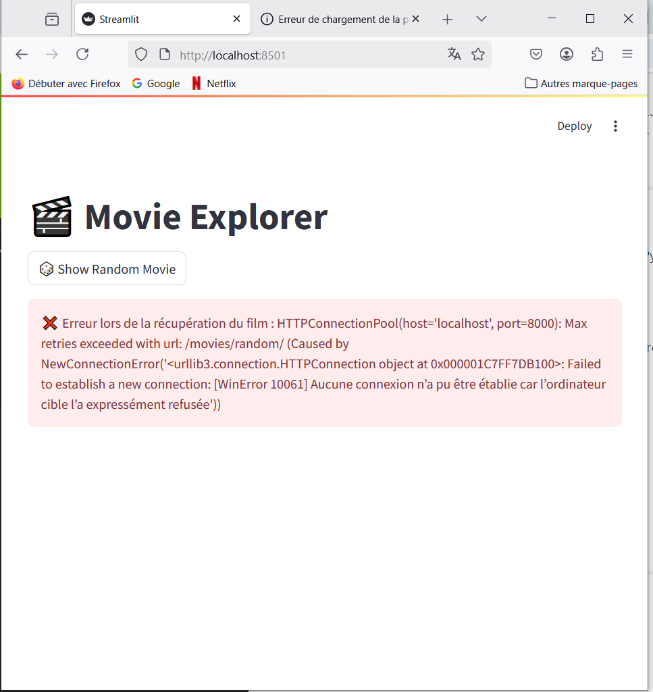

Question1:Il faut souvent enregistrer (commit) le film (Movie) avant d’ajouter des acteurs (Actors) car ces derniers dépendent de la clé primaire du film (souvent un id auto-généré). Tant que le film n’est pas enregistré, son id n’existe pas, ce qui empêche de créer une relation valide via la clé étrangère (movie_id). Cela garantit l’intégrité référentielle et évite les erreurs liées aux contraintes de clé étrangère.

Question2:Différence entre lazy loading et eager loading (joinedload) en SQLAlchemy :
Lazy loading (chargement paresseux) :
Les données liées (ex : acteurs d’un film) ne sont chargées que lorsque tu y accèdes. Cela provoque une requête supplémentaire à ce moment-là.
Risque : beaucoup de requêtes si tu accèdes à plusieurs relations (problème N+1).

Eager loading (joinedload) (chargement anticipé) :
Les données liées sont chargées immédiatement avec la requête principale via un JOIN.
Avantage : une seule requête pour récupérer le film et ses acteurs, plus rapide si tu as besoin des relations directement.

Q# No code was selected, so we'll create a basic example based on the context provided

from sqlalchemy import create_engine, Column, Integer, String, ForeignKey
from sqlalchemy.orm import sessionmaker, relationship
from sqlalchemy.ext.declarative import declarative_base

# Create a database engine
engine = create_engine('sqlite:///movies.db')

# Create a configured "Session" class
Session = sessionmaker(bind=engine)

# Create a base class for declarative class definitions
Base = declarative_base()

# Define the Movie class
class Movie(Base):
    __tablename__ = 'movies'
    id = Column(Integer, primary_key=True)
    title = Column(String)
    actors = relationship("Actor", backref="movie")

# Define the Actor class
class Actor(Base):
    __tablename__ = 'actors'
    id = Column(Integer, primary_key=True)
    actor_name = Column(String)
    movie_id = Column(Integer, ForeignKey('movies.id'))

# Create all tables in the engine
Base.metadata.create_all(engine)

# Create a new session
session = Session()

# Create a new movie
movie = Movie(title="Inception")
session.add(movie)
session.commit()

# Create new actors
actor1 = Actor(actor_name="Leonardo DiCaprio", movie_id=movie.id)
actor2 = Actor(actor_name="Tom Hardy", movie_id=movie.id)
session.add(actor1)
session.add(actor2)
session.commit()

# Retrieve the movie and its actors
movie = session.query(Movie).options(joinedload(Movie.actors)).first()

# Format the list of actors
actors_string = ", ".join(actor.actor_name for actor in movie.actors)

# Print the result
print(f"Movie: {movie.title}, Actors: {actors_string}")uestion3:Pour formater la liste des acteurs récupérés depuis la base de données en une chaîne de caractères utilisable dans un prompt pour un LLM, il suffit d’utiliser une compréhension de liste avec join, comme ceci : ", ".join(actor.actor_name for actor in movie.actors). Cela transforme une liste d’acteurs en une phrase fluide, par exemple : "Leonardo DiCaprio, Tom Hardy", ce qui permet d’intégrer naturellement les noms dans un prompt du type : « Génère un résumé du film Inception (2010), réalisé par Christopher Nolan et mettant en vedette Leonardo DiCaprio, Tom Hardy. »

